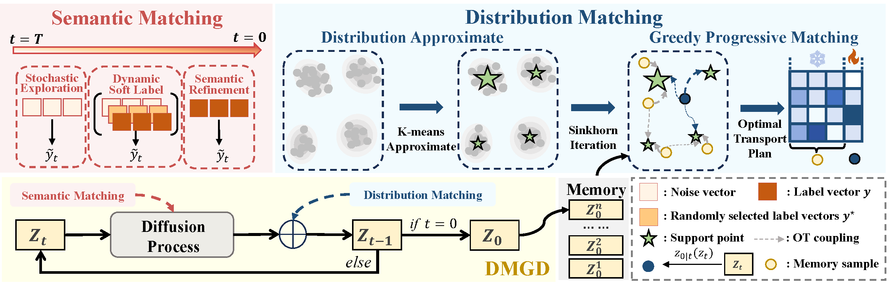
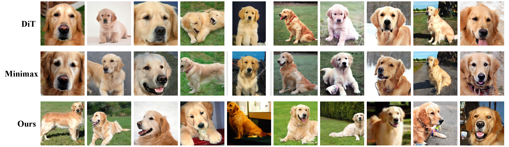

# [CVPR 2026] DMGD: Train-Free Dataset Distillation with Semantic-Distribution Matching in Diffusion Models


[](https://arxiv.org/abs/2605.03877)
[](https://cvpr.thecvf.com/virtual/2026/poster/36526)

> **Official Implementation** of Dual Matching Guided Diffusion (DMGD), a training-free diffusion-based dataset distillation framework, outperforming state-of-the-art fine-tuning methods on ImageNet-1K and its subsets.


## ✨ Key Highlights
- **🚀 Fully Training-Free**: Introduces guidance only during the diffusion sampling process, requiring no additional fine-tuning or training stages, delivering orders of magnitude higher computational efficiency
- **🎯 Dual Matching Mechanism**: Decouples dataset distillation into two independent objectives: **Semantic Matching** and **Distribution Matching**, with theoretical guarantees on the risk upper bound of the distilled dataset
- **🌈 Diversity Enhancement**: Proposes a dynamic soft label guidance mechanism that significantly improves the diversity of synthetic data while maintaining semantic alignment
- **📊 Optimal Transport Distribution Alignment**: Designs a distribution matching loss based on optimal transport theory, and proposes two acceleration strategies (Distribution Approximate Matching, Greedy Progressive Matching) for efficient global distribution structure alignment
Our complete framework is illustrated in fig2.

# 🚀 Quick Start

## 1. Environment Setup

First, follow the instructions in the [Minimax](https://github.com/vimar-gu/MinimaxDiffusion) to install all required dependencies and set up the development environment.

After environment configuration, download the pre-trained DiT and VAE weights and place them in the `pretrained_models/` directory.

## 2. Sampling

Run the following command to generate surrogate datasets using DMGD:

```bash
python sample.py \
    --model DiT-XL/2 \
    --image-size 256 \
    --save-dir Your_path \
    --spec nette \
    --ckpt pretrained_models/DiT-XL-2-256x256.pt \
    --num-samples 50 \
    --guidance-scale 0.05 \
    --data_path Dataset_Path/train
```

**Parameter Explanation:**
- `--save-dir`: Directory to save generated images
- `--spec`: Name of target dataset
- `--ckpt`: Path to the pre-trained DiT checkpoint file
- `--num-samples`: Total number of samples to generate (IPC)
- `--guidance-scale`: guidance scale for distribution matching
- `--data_path`: Path to your training dataset directory
For more hyperparameter settings, please refer to [sample.py](./sample.py).

## 3. Evaluation

To evaluate the model performance, run the following command:

```bash
python train.py \
    -d imagenet \
    --imagenet_dir Your_Results_Path Dataset_Path \
    -n resnet_ap \
    --nclass 10 \
    --norm_type instance \
    --ipc 50 \
    --tag test \
    --slct_type random \
    --spec nette
```

**Parameter Explanation:**
- `--imagenet_dir`: Paths to your results directory and dataset directory
- `--n`: Evaluation Network
- `--nclass`: Number of classes in your dataset
- `--ipc`: Images per class for evaluation
- `--spec`: Name of target dataset
---

**Note:** Replace all placeholders (`Your_path`, `Dataset_Path`, `Your_Results_Path`) with your actual directory paths before executing the commands.


## 📊 Experimental Results
### Performance Comparison on ImageNet Subsets (Hard-label Protocol, ResNet10-AP Top-1 Accuracy)
table1 shows the comparison results between our method and state-of-the-art methods on ImageNet-Woof and ImageNet-Nette. Our method achieves the best performance under all IPC settings and can be used as a plug-and-play module to improve the performance of existing methods.

| IPC | ImageNet-Woof | | | ImageNet-Nette | | |
| --- | --- | --- | --- | --- | --- | --- |
| 10 | 20 | 50 | 10 | 20 | 50 |
| Random | 29.4±0.8 | 32.7±0.4 | 47.2±1.3 | 54.2±1.6 | 63.5±0.5 | 76.1±1.1 |
| DM  | 30.3±1.2 | 35.2±0.6 | 47.1±1.1 | 60.8±0.6 | 66.5±1.1 | 76.2±0.4 |
| DiT  | 34.7±0.5 | 41.1±0.8 | 49.3±0.2 | 59.1±0.7 | 64.8±1.2 | 73.3±0.9 |
| MiniMax  | 39.2±1.3 | 45.8±0.5 | 56.3±1.0 | 62.0±0.2 | 66.8±0.4 | 76.6±0.2 |
| MGD3  | 40.4±1.9 | 43.6±1.6 | 56.5±0.8 | 66.4±2.4 | 71.2±0.5 | 79.5±1.3 |
| **Ours** | **40.8±1.1** | **46.7±1.4** | **60.1±0.8** | **68.4±0.2** | **72.6±0.6** | **80.6±0.5** |
| Full dataset | | 87.5±0.5 |||   94.6±0.5 | |

### Qualitative Results


## 📝 Citation
If you find our work useful in your research, please cite our paper:
```bibtex
@misc{wang2026dmgdtrainfreedatasetdistillation,
      title={DMGD: Train-Free Dataset Distillation with Semantic-Distribution Matching in Diffusion Models}, 
      author={Qichao Wang and Yunhong Lu and Hengyuan Cao and Junyi Zhang and Min Zhang},
      year={2026},
      eprint={2605.03877},
      archivePrefix={arXiv},
      primaryClass={cs.CV},
      url={https://arxiv.org/abs/2605.03877}, 
}
```

## 🙏 Acknowledgments
We thank the contributors of the following open-source projects:
- [DiT](https://github.com/facebookresearch/DiT)
- [diffusers](https://github.com/huggingface/diffusers)
- [Minimax-DD](https://github.com/vimar-gu/MinimaxDiffusion)


---

⭐ If you like this project, please give us a star! Your support is our motivation for continuous improvement. If you have any questions or suggestions, please contact us via GitHub Issues.

---
